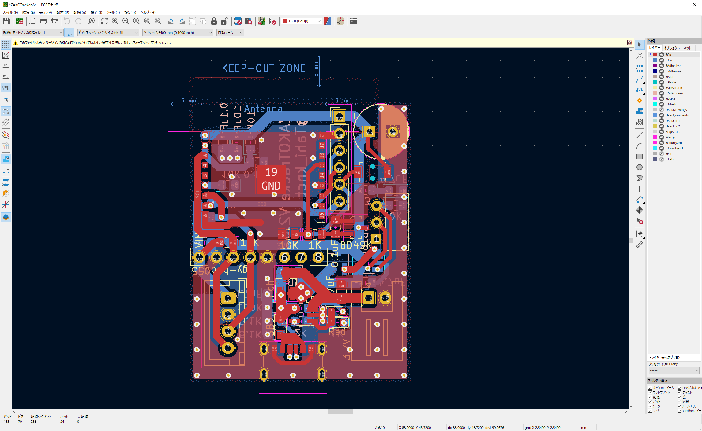

# ZAKOTrackerV2.0

## 概要-Overview

簡易的にIMUの値をESP-NOWを使って送信する基板。

## 動作環境-Requirement

- VSCode
- KiCad 6.0
- Unity 2019.4.31f1

## 使い方-Usage

-

## 仕様-Features
- [使用部品一覧]()

## リファレンス-Reference

-

## 著者-Author

- [Twitter](https://twitter.com/Tahi_knct)

- [note](https://note.com/tahi314)

- [GitHub](https://github.com/Tahi-knct?tab=repositories)

## ライセンス-Licence
 この 作品 は <a rel="license" href="http://creativecommons.org/licenses/by-nc/4.0/">クリエイティブ・コモンズ 表示 - 非営利 4.0 国際 ライセンス</a>の下に提供されています。