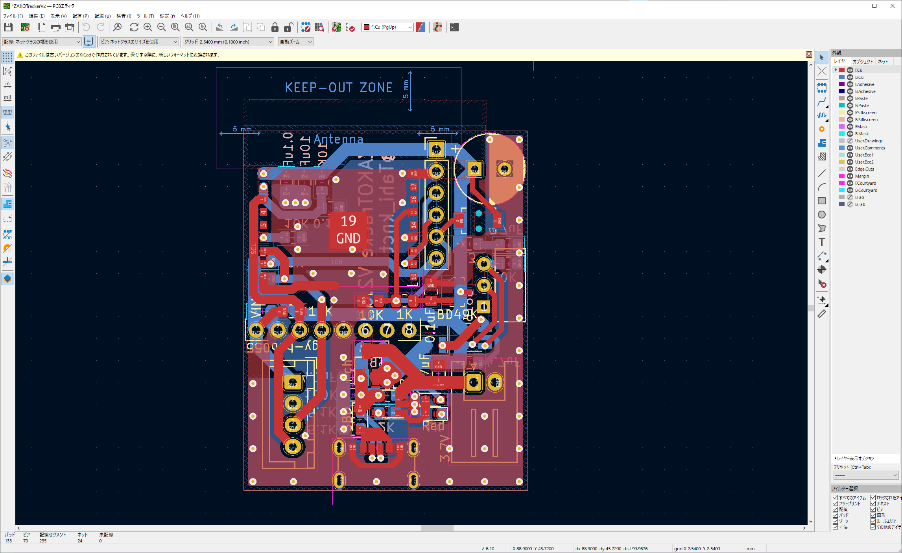

# ZAKOTrackerV2 - Hardware

自作VRモーショントラッカー「ZAKOTracker」V2の基板設計データ。

BNO055 IMUの値をESP-NOWで送信するセンサーノード基板です。

## 関連リポジトリ

- [ZAKOTrackerV2_ESP8266](https://github.com/Tahi314/ZAKOTrackerV2_ESP8266) - 送信側ファームウェア（ESP8266）
- [ZAKOTrackerV2_ESP32](https://github.com/Tahi314/ZAKOTrackerV2_ESP32) - 受信側ファームウェア（ESP32）

## 設計環境

- KiCad 6.0

## ディレクトリ構成

- `kicad/` - KiCad プロジェクトファイル
- `3d/` - 3Dモデル
- `pic/` - 画像

## 参考

- [ZAKOTrackerV1.0の解説記事（Zenn）](https://zenn.dev/tahi_314/articles/8bd749271e5c29)

## 著者

- [X](https://x.com/Tahi_314_main)
- [GitHub](https://github.com/Tahi314)

## ライセンス

 この作品は<a rel="license" href="http://creativecommons.org/licenses/by-nc/4.0/">クリエイティブ・コモンズ 表示 - 非営利 4.0 国際 ライセンス</a>の下に提供されています。
